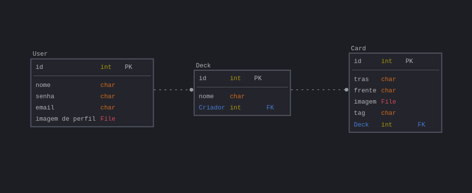

# flashcards
Backend para um aplicativo de flashcards desenvolvido para a cadeira DLSC817 - Desenvolvimento de Software Educacional

## Pacotes
1. django
2. djangorestframework
3. django-cors-headers
4. pillow

## APIs

### Usuários

#### `GET /`
Retorna todos os usuários cadastrados.  
**Resposta:** JSON com lista de usuários.

#### `POST /registrar/`
Registra um novo usuário.  
**Campos:**
- `nome`: string (obrigatório)
- `senha`: string (obrigatório)
- `confirmacaoSenha`: string (obrigatório)
- `email`: string (opcional)
- `imagemDePerfil`: file (opcional)  
**Resposta:** Mensagem de sucesso ou erro.

#### `POST /login/`
Realiza login de um usuário.  
**Campos:**
- `nome`: string
- `senha`: string  
**Resposta:** Mensagem de sucesso ou erro.

#### `POST /logout/`
Realiza logout do usuário autenticado.  
**Resposta:** Mensagem de sucesso.

---

### Decks

#### `POST /criar_deck/`
Cria um novo deck para o usuário autenticado.  
**Campos:**
- `nome`: string  
**Resposta:** JSON com o deck criado.

#### `PATCH /editar_deck/`
Edita o nome de um deck existente.  
**Campos:**
- `id`: int (ID do deck)
- `novoNome`: string  
**Resposta:** Mensagem de sucesso ou erro.

#### `DELETE /deletar_deck/<id>`
Deleta um deck pelo ID.  
**Resposta:** Mensagem de sucesso ou erro.

#### `GET /get_deck/<id>`
Retorna um deck e seus cards pelo ID.  
**Resposta:** JSON com o deck e seus cards.

---

### Cards

#### `POST /criar_card/`
Cria um novo card em um deck.  
**Campos:**
- `frente`: string
- `tras`: string
- `imagem`: file (opcional)
- `deck`: string (nome do deck)
- `tag`: string (opcional)  
**Resposta:** Mensagem de sucesso e dados do card.

#### `PATCH /editar_card/`
Edita um card existente.  
**Campos:**
- `id`: int (ID do card)
- `novaFrente`: string (opcional)
- `novaTras`: string (opcional)
- `novaImagem`: file (opcional)
- `novaTag`: string (opcional)  
**Resposta:** Mensagem de sucesso e dados atualizados.

#### `DELETE /deletar_card/<id>`
Deleta um card pelo ID.  
**Resposta:** Mensagem de sucesso ou erro.

#### `GET /get_card/<id>`
Retorna um card pelo ID.  
**Resposta:** JSON com os dados do card.
