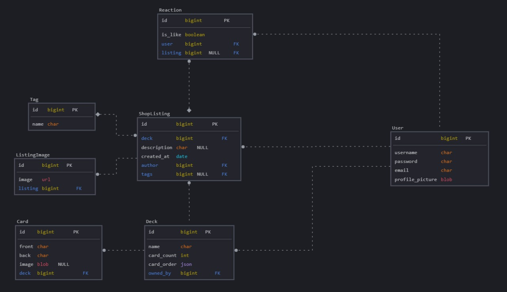

# flashcards
A full stack web application for creating, sharing, and reviewing flashcards with AI-powered features. Users can Organize their cards into decks, study them on demand, take AI-generated tests based on the contents of their decks, and visually keep track of their progress and stats with graphs. Try it by following the instructions below.

## How to execute:
1. Open a terminal and create a virtual environment:
```python3 -m venv .venv```
2. Activate the virtual environment:
```source .venv/bin/activate```
3. Install Python packages
```pip install -r requirements.txt```
4. Access the Django REST framework project:
```cd backend/```
5. Add your Google Gemini API key to the .env file
```GENAI_API_KEY=<YOUR_API_KEY>```
6. Execute the API:
```python manage.py runserver```
7. Open up a new terminal and access the React project:
```cd frontend/```
8. Install node packages:
```npm install```
9. Build the project:
```npm run build```
10. Preview the interface;
```npm run preview```

## db schema
