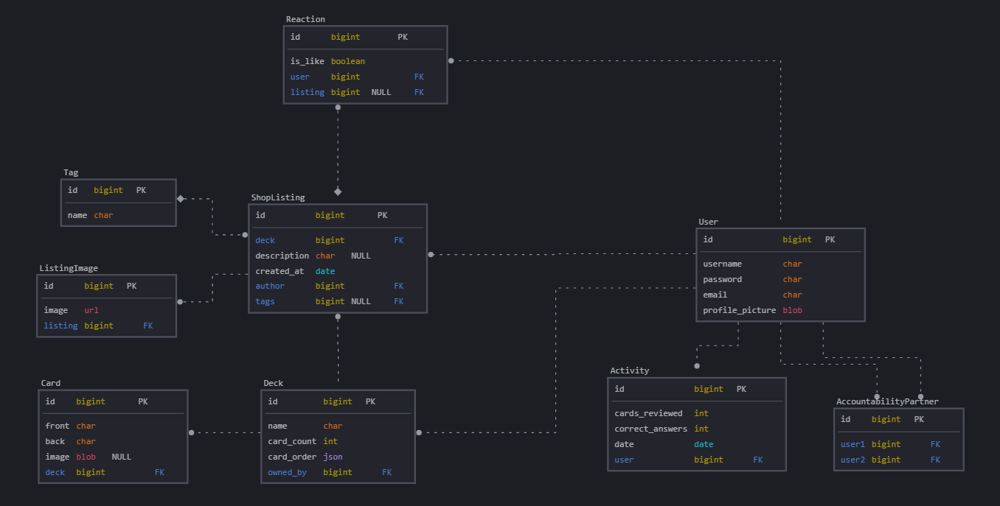

# flashcards
A full stack web application for creating, sharing, and reviewing flashcards with AI-powered features.

# pip packages
1. django
2. djangorestframework
3. django-cors-headers
4. djangorestframework-simplejwt
5. django-filter
6. email-validator
7. dotenv
8. Pillow
9. google-genai

# npm packages
1. tailwindcss
2. @tailwindcss/vite
3. daisyui
4. axios
5. axios-auth-refresh
6. react-router-dom

# db schema
